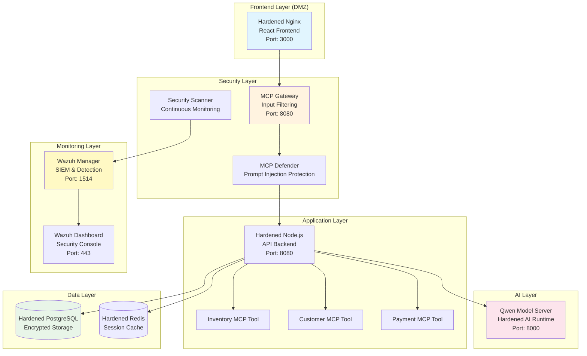

# Moby SwagStore Demo - Secure MCP-Enabled E-commerce Platform

[](https://hub.docker.com/)
[](https://wazuh.com/)
[](https://modelcontextprotocol.io/)
[](https://qwenlm.github.io/)

A comprehensive security demonstration platform showcasing **secure AI agent implementations** using Docker Hardened Images, MCP Gateway security, Wazuh monitoring, and cloud-native best practices.

## 🏗️ Architecture Overview



## 🎯 Product Catalog - Moby SwagStore

### 👕 Apparel Collection
- **Moby T-Shirt - Ocean Blue** - Official Docker mascot tee in premium cotton
- **Moby Hoodie - Whale Gray** - Premium fleece hoodie with whale gray colorway
- **Docker Logo Polo** - Professional polo shirt with embroidered Docker logo

### 🥤 Drinkware Collection  
- **Docker Ceramic Mug** - High-quality dishwasher-safe ceramic mug
- **Moby Stainless Steel Water Bottle** - Insulated, BPA-free, eco-friendly
- **Docker Travel Tumbler** - Double-wall insulated for hot/cold beverages

### 🎒 Accessories & Tech
- **Docker Sticker Pack** - Waterproof vinyl stickers for laptops
- **Moby Backpack** - Durable canvas backpack with Docker branding
- **Docker USB Drive** - 32GB encrypted USB drive with Docker logo

## 🛡️ Security Features

### **Multi-Layer Defense Architecture**

#### 🔐 **Container Security**
- **Docker Hardened Images**: All services run on security-hardened base images
- **Rootless Containers**: All containers run as non-root users (UID 1000+)
- **Read-Only Filesystems**: Containers use read-only root filesystems with tmpfs for temp data
- **Minimal Capabilities**: Containers drop all capabilities except essential ones
- **No New Privileges**: Security option prevents privilege escalation

#### 🚨 **Network Security**
- **Network Segmentation**: Frontend, backend, and monitoring networks isolated
- **Internal Networks**: Backend services communicate over internal-only networks
- **TLS Everywhere**: All inter-service communication encrypted with TLS 1.3
- **Firewall Rules**: Restrictive ingress/egress rules per service

#### 🛡️ **AI Agent Security**
- **MCP Gateway**: Centralized security layer for all MCP tool interactions
- **Input Sanitization**: Advanced prompt injection detection and filtering
- **Output Filtering**: Sensitive data redaction before responses
- **Rate Limiting**: Prevent abuse and automated attacks
- **Audit Logging**: Complete audit trail of all AI interactions

#### 📊 **Monitoring & Detection**
- **Wazuh SIEM**: Real-time security event detection and analysis
- **Container Monitoring**: Runtime security monitoring of all containers  
- **Vulnerability Scanning**: Continuous image and dependency scanning
- **Threat Detection**: ML-powered anomaly detection for AI interactions

## 🚀 Quick Start

### Prerequisites
- Docker Engine 20.10+
- Docker Compose 2.0+
- 8GB RAM minimum (16GB recommended)
- 20GB free disk space

### 1. Clone and Setup
```bash
# Clone the repository
git clone https://github.com/ajeetraina/swag-store-demo.git
cd swag-store-demo

# Run the setup script
chmod +x setup.sh
./setup.sh
```

### 2. Configuration
```bash
# Copy environment template
cp .env.example .env

# Generate secrets
./scripts/generate-secrets.sh

# Configure Wazuh (optional)
cp config/wazuh/wazuh.conf.example config/wazuh/wazuh.conf
```

### 3. Deploy
```bash
# Start all services
docker compose up -d

# Verify deployment
./scripts/health-check.sh

# View logs
docker compose logs -f
```

## 🎯 Access Points

| Service | URL | Purpose |
|---------|-----|---------|
| **SwagStore Frontend** | http://localhost:3000 | Customer shopping interface |
| **Wazuh Dashboard** | https://localhost:443 | Security monitoring console |
| **MCP Gateway** | http://localhost:8080 | AI tool gateway (internal) |
| **API Backend** | http://localhost:8080/api | REST API (internal) |
| **Health Checks** | http://localhost:8080/health | System status |

**Default Credentials:**
- Wazuh Dashboard: `admin / SecretPassword123!`
- API Access: Generated JWT tokens (see `./scripts/get-token.sh`)

